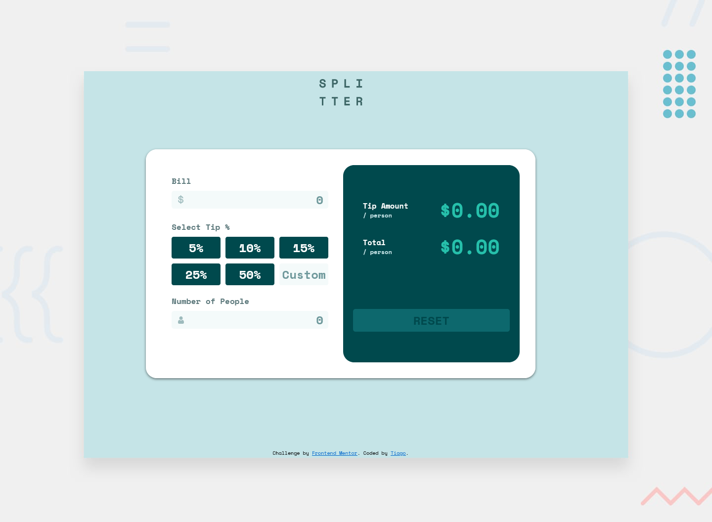

# Frontend Mentor - Tip calculator app solution

This is a solution to the [Tip calculator app challenge on Frontend Mentor](https://www.frontendmentor.io/challenges/tip-calculator-app-ugJNGbJUX). Frontend Mentor challenges help you improve your coding skills by building realistic projects.

## Table of contents

- [Overview](#overview)
  - [The challenge](#the-challenge)
  - [Screenshot](#screenshot)
  - [Links](#links)
- [My process](#my-process)
  - [Built with](#built-with)
  - [What I learned](#what-i-learned)
  - [Continued development](#continued-development)
  - [Useful resources](#useful-resources)
- [Author](#author)
- [Acknowledgments](#acknowledgments)

## Overview

### The challenge

Users should be able to:

- View the optimal layout for the app depending on their device's screen size
- See hover states for all interactive elements on the page

### Screenshot

### Links

- Solution URL: [Github](https://github.com/brtiago/tip-calculator-app-frontendmentor)
- Live Site URL: [Vercel](https://tip-calculator-weld-five.vercel.app/)

## My process

### Built with

- Semantic HTML5 markup
- CSS custom properties
- Flexbox
- CSS Grid
- Mobile-first workflow
- JavaScript

### What I learned
Throughout this project, I had the opportunity to learn and experiment with different technologies in web development. Some of my major learnings are summarized below:

*   Semantic HTML5 markup: I have learned the importance of using semantic HTML tags and attributes to create accessible and meaningful content for both humans and machines.
*   CSS custom properties: By using CSS variables, I can write more maintainable and flexible styles that reduce repetition and enhance consistency. As a result, making design changes becomes much easier and less time-consuming.
*   Flexbox: I have gained a solid understanding of how flexbox works and how it can be used to lay out and align elements in responsive web design. I particularly liked the ability to control the direction, order, justification, and alignment of items within a container.
*   CSS Grid: I started my journey with CSS grid by reading and practicing the basics, such as creating a grid container, defining grid columns and rows, and placing items inside grid cells. I also learned advanced techniques like grid-template-areas and subgrids, which provide more control and flexibility over the layout.
*   Mobile-first workflow: I have adopted a mobile-first approach to design, meaning that I consider the needs of smaller screens first and then gradually enhance the layout and features for larger screens. This approach encourages me to prioritize content, performance, and accessibility from the beginning.
*   JavaScript: While I did not use JavaScript extensively in this project, I learned some fundamental concepts like variable declaration, function declaration, conditional statements, loops, and DOM manipulation. I also learned how to troubleshoot errors using browser tools like console.log and debugger.

Moreover, the following resources were absolutely helpful and informative in enhancing my learning experience:

### Useful resources

- [A Complete Guide to Flexbox](https://css-tricks.com/snippets/css/a-guide-to-flexbox/) - This guide explains everything about flexbox, focusing on all the different possible properties for the parent element (the flex container) and the child elements (the flex items). It also includes history, demos, patterns, and a browser support chart.
- [A Complete Guide to CSS Grid](https://css-tricks.com/snippets/css/complete-guide-grid/) - This helped me for learn CSS grid, focusing on all the settings both for the grid parent container and the grid child elements.
- [htmlreference](https://htmlreference.io/) - This is an amazing free guide to HTML. It features all elements and attributes. 

## Author

- Website - [Tiago](https://github.com/brtiago)
- Frontend Mentor - [@brtiago](https://www.frontendmentor.io/profile/brtiago)
